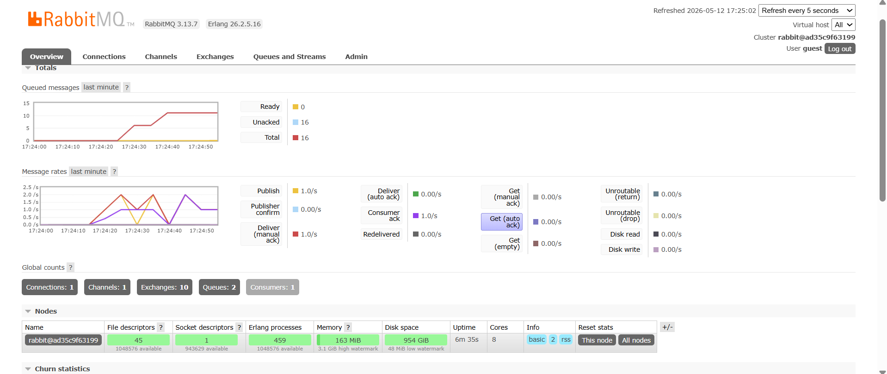

# Modul 9 Software Architecture - Subscriber

### Questions
1. **What is amqp?**

Advanced Message Queuing Protocol (AMQP) adalah protokol komunikasi standar yang digunakan untuk pertukaran pesan antar aplikasi atau layanan. AMQP membuat sistem saling berkomunikasi melalui message broker seperti RabbitMQ.

2. **What does it mean? guest:guest@localhost:5672 , what is the first guest, and what is the second guest, and what is localhost:5672 is for?**

`guest` pertama adalah username untuk login ke server RabbitMQ, `guest` kedua untuk password akun tersebut, dan `localhost:5672` adalah alamat server RabbitMQ (`localhost` berarti server berjalan di komputer tersebut dan `5672` adalah port default yang digunakan RabbitMQ untuk komunikasi)

### Slow subscriber

Berdasarkan gambar, total pesan dalam queue adalah 16. Hal ini terjadi karena ini adalah simulasi slow subscriber, publisher mengirimkan banyak pesan dengan cepat secara berulang kali, namun subscriber memproses pesan lebih lambat, sehingga pesan-pesan yang belum sempat diproses menumpuk di queue. Angka 16 mencerminkan jumlah pesan yang sudah diterima subscriber tapi belum selesai diproses, dan jumlah tersebut akan terus bertambah setiap kali publisher dijalankan sebelum subscriber selesai memproses antrian sebelumnya.